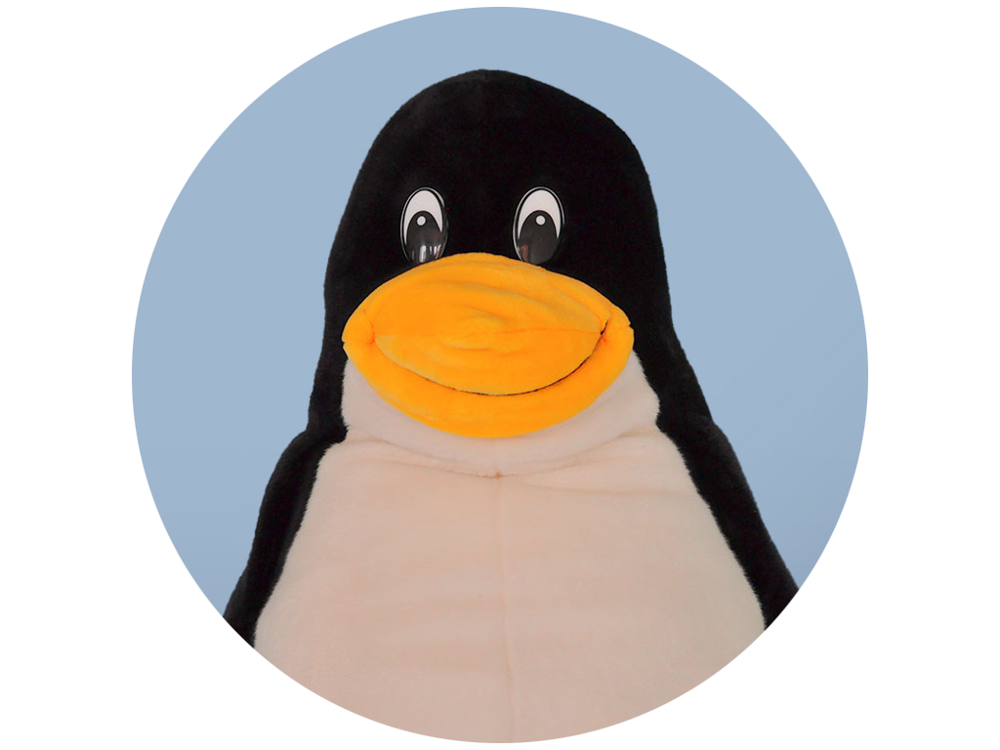

# Slidev Theme<br><span class="highlight">Puzzle</span>

Firstname lastname \
<a href="mailto:email@puzzle.ch">email@puzzle.ch</a>

---
layout: agenda
---

# Agenda

- Introduction
- Who we are and what we do
- Our Success Stories
- Our Services
- Q&A

---
layout: meet
---

# Nice to meet you

::members::

<div>
  

Daniel Müller

Key Account Manager \
mueller@puzzle.ch

</div>

<div>
  

Maria Meier

Members Coach \
meier@puzzle.ch

</div>

<div>
  

Peter Schmid

Software Engineer, \
Member of the Technical Board \
schmid@puzzle.ch

</div>

<!--
Get member photos here:

https://files.puzzle.ch/apps/files/files/6267463?dir=/ux/Projects/Puzzle/00_Puzzle%20Team/00_Member_Fotos/03_Rund%20fuer%20Praesis/Assets_BG_Unifarbe
-->

---
layout: meet
---

# Nice to meet you

::members::

<div>
  

Daniel Müller

Key Account Manager \
mueller@puzzle.ch

</div>

<div>
  

Maria Meier

Members Coach \
meier@puzzle.ch

</div>

---
layout: meet
---

# Nice to meet you

::members::

<div>
  

Daniel Müller

Key Account Manager \
mueller@puzzle.ch

</div>

---

# What is Slidev?

Slidev is a slide maker and presentation tool designed for developers. It includes the following features:

- 📝 **Text-based** - focus on your content with Markdown, then style it later
- 🎨 **Themable** - themes can be shared and reused as npm packages
- 🧑‍💻 **Developer Friendly** - code highlighting, live coding with autocompletion
- 🤹 **Interactive** - embed Vue components to enhance your expressions
- 🎥 **Recording** - built-in recording and camera view
- 📤 **Portable** - export to PDF, PPTX, PNGs, or even a hostable SPA
- 🛠 **Hackable** - virtually anything that's possible on a webpage is possible in Slidev

<br>
<br>

Read more about [Why Slidev?](https://sli.dev/guide/why)

---
layout: intro
---

# What is<br><span class="highlight">important</span> to us

---

# Navigation

Hover on the bottom-left corner to see the navigation's controls panel

## Keyboard Shortcuts

|                                                      |                             |
| ---------------------------------------------------- | --------------------------- |
| <kbd>space</kbd> / <kbd>tab</kbd> / <kbd>right</kbd> | next animation or slide     |
| <kbd>left</kbd> / <kbd>shift</kbd><kbd>space</kbd>   | previous animation or slide |
| <kbd>up</kbd>                                        | previous slide              |
| <kbd>down</kbd>                                      | next slide                  |

---
layout: image-right
image: https://cover.sli.dev
---

# Code

Use code snippets and get the highlighting directly!

```ts
interface User {
  id: number;
  firstName: string;
  lastName: string;
  role: string;
}

function updateUser(id: number, update: Partial<User>) {
  const user = getUser(id);
  const newUser = { ...user, ...update };
  saveUser(id, newUser);
}
```

---
layout: center
class: "text-center"
---

# Learn More

[Documentation](https://sli.dev) · [GitHub](https://github.com/slidevjs/slidev) · [Showcases](https://sli.dev/resources/showcases)

<PoweredBySlidev mt-10 />

---
layout: end
---

# Merci!

Mehr Informationen zu Puzzle: \
[www.puzzle.ch](https://www.puzzle.ch/)

<PoweredBySlidev mt-10 />
